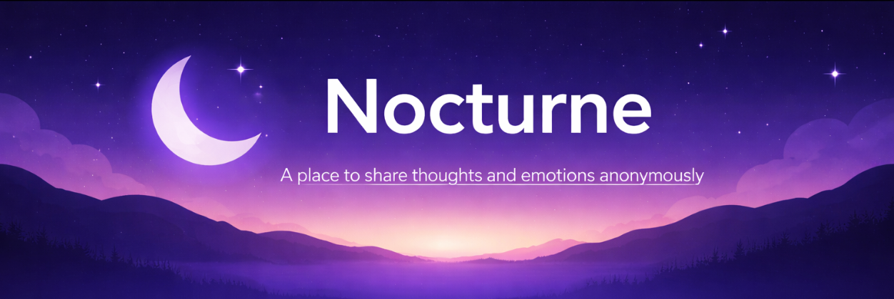

<p align="center">
  
</p>

<h1 align="center">Nocturne</h1>

<p align="center">
  <a href="https://nocturnesocial.in/">🌐 Live Demo</a> •
  <a href="#features">✨ Features</a> •
  <a href="#installation">⚙️ Setup</a>
</p>

---

**Nocturne** is an anonymous, night-focused social platform designed for deep thoughts, emotional expression, and real-time interaction after dark. It creates a safe digital space where users can connect without identity pressure.

---

## 🚀 Features (v1 Updates)

* 🌌 **Anonymous Social Experience**
  Interact freely without revealing identity.

* 💭 **Night Thoughts Stream**
  A high-performance unified feed replacing the legacy Whisper Wall and Diaries, heavily indexed for instant loading.

* 🔐 **Encrypted Vault**
  Server-side AES-256-GCM encryption for private diaries. Even in a database breach, your thoughts remain unreadable.

* 🎨 **Deep Customization Ecosystem**
  Transform your UI. Choose from Dyslexic-friendly fonts, custom UI corner radii, dynamic glassmorphism (frosted, solid, crystal), and direct Pinterest integration for aesthetic dark wallpapers.

* 🎧 **Audio Lounge & Midnight Café**
  Join voice-based rooms and visual hangouts for late-night ambient conversations.

* 🌙 **Dark-First Design**
  Designed exclusively for night usage, featuring smooth micro-animations and aesthetic controls.

---

## 🧱 Tech Stack

### Frontend
* React / Vite
* Wouter (Routing)
* Tailwind CSS & Shadcn UI
* TanStack Query

### Backend
* Node.js / Express
* Drizzle ORM
* PostgreSQL (Neon Serverless)
* AES-256-GCM Cryptography (Native Node `crypto`)

---

## 📁 Project Structure

```
nocturne-web/
│
├── client/        # Frontend code (React, UI Components)
├── server/        # Backend API, Routes, Controllers, Drizzle ORM
├── shared/        # Shared Drizzle schema and Zod types
├── public/        # Static assets
│
├── .env.example   # Environment variables template
├── README.md      # Project documentation
```

---

## ⚙️ Installation

### 1. Clone the repository

```bash
git clone https://github.com/Deviprasad-beginner/nocturne-web
cd nocturne-web
```

### 2. Install dependencies

```bash
npm install
```

### 3. Setup environment variables

Create a `.env` file based on `.env.example`. You will need a Neon Postgres Database URL.

### 4. Database Setup

```bash
npx drizzle-kit push
```

### 5. Run the app

```bash
npm run dev
```

---

## 🔐 Security & Privacy Architecture

* **Zero-Knowledge Architecture:** Private entries are encrypted via AES-256-GCM on the backend before touching the database.
* **Ephemeral Data:** A dedicated Cron job automatically scrubs expired 24-hour whispers to enforce the anti-social philosophy.
* **Complete Erasure:** `DELETE /api/v1/users/me` permanently destroys all associated footprints and records.

---

## 📈 Future Improvements

* 🛡️ Abuse detection & moderation system
* 📊 Analytics dashboard
* 📱 Native mobile app (Android/iOS)
* 🔔 Smart push notifications

---

## 🤝 Contributing

Pull requests are welcome. For major changes:

1. Create a new branch
2. Make changes
3. Open a pull request

---

## 📌 Status

> 🚀 **Production-Ready v1**
> The backend infrastructure is fully indexed, typed, and encrypted. Ready for launch.

---

## 👤 Author

**Deviprasad Mishra**
Builder of Nocturne

---

## 🌌 Vision

> A place where people are most real — at night, in silence, without identity.
